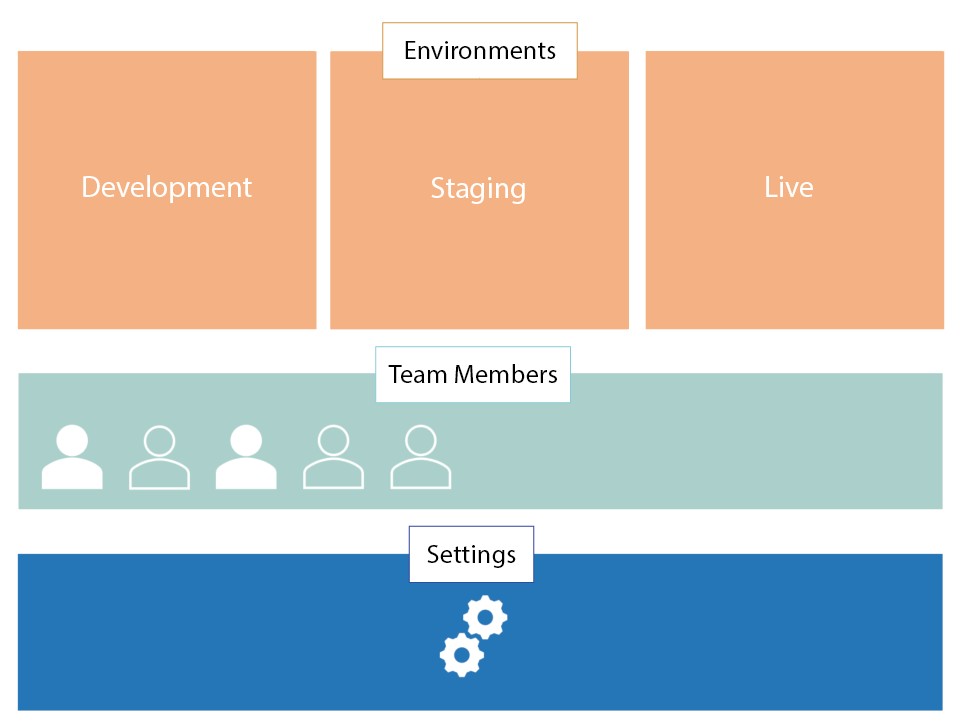

# Umbraco Cloud Project Overview

Umbraco Cloud Projects are made of three major components: Environments, Team Members/Invite Users, and a Settings section.

## Environments

The number of _Environments_ in your project is dependent on which plan you are on:

* With the **Starter Plan**, you have the option to add a _Development_ environment.
* With the **Standard Plan**, you get a _Development_ and a _Live_ environment with the option to add a _Staging_ environment. You can add/remove environments as needed
* With the **Professional Plan**, you get a _Development_, a _Staging_, and a _Live_ environment - as with the Standard Plan you can add/remove environments as needed.
* With the **Enterprise Plan**, you get a _Development_, a _Staging_, and a _Live_ environment - as with the Professional Plan you can add/remove environments as needed.

To get a technical overview of your Cloud environments, see the [Environments](../../Umbraco-Cloud/Getting-Started/Environments/) article. For more information on how to add or remove environments, see the [Manage Environments](../../Umbraco-Cloud/Set-Up/Manage-Environments/) article.

## Team Members/Invite Users

Another major component of your Umbraco Cloud project is _Team Members_. When you add team members to a project, they will automatically be added as backoffice users in all the environments. Team members can be added as _Admins_, _Writers_, or _Readers_. Refer to the [Team Members](../../Umbraco-Cloud/Set-Up/Team-Members/) article to learn more about these roles.

## Hello there

## Settings

In the _Settings_ section, you can manage and configure your project to fit your needs. Learn more about the different settings in the [Project Settings](../../Umbraco-Cloud/Set-Up/Project-settings/) article.
